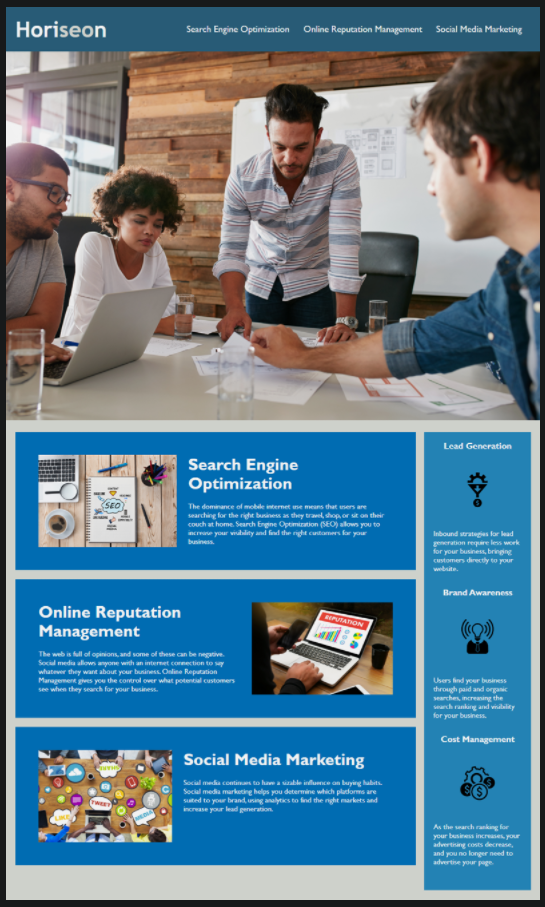

# Horiseon's Code Refactor

## Table-of-Contents

- [Description](#description)
- [Deployed Site](#deployed-site)
- [Features](#features)
- [Technologies](#technologies)
- [Future Development](#future-development)
- [Credits](#credits)

## Description

In this project, I challenged myself to refactor an existing codebase to make it more accessible and organized.  This project mimics an on-the-job ticket in which our client, Horiseon, had a mostly-functional, visually appealing website that did not meet accessibility or search engine optimization standards. They needed their codebase to be updated in order to meet these standards, while still keeping the same visual look.

## Deployed Site

Follow [this link](https://ashlynn4567.github.io/Code-Refactor/) to view and use my site!

## Features

This is how the page appears to viewers. This code is not built with flexbox CSS, so it does not adapt to multiple screen sizes. However, flexbox was outside the scope of the assignment.

## Technologies

- HTML
- CSS

## Future Development

In the future, I would like to add the following improvements:

- If the client wished, adding flexbox and media queries to this site's CSS would greatly improve the user experience of the website.

I'm always interested in refactoring code to improve it's functionality. If you would like to suggest your own improvements, you can reach me at the links below.

- <a href="mailto:ashlynn4567@gmail.com">Email</a>
- <a href="https://github.com/ashlynn4567">GitHub</a>
- <a href="https://www.linkedin.com/in/ashley-lynn-smith/">LinkedIn</a>

## Credits

This project was built with the help of the University of Oregon's Coding Boot Camp.

## Licensing

The application is covered under the following license: [MIT](https://opensource.org/licenses/MIT)
