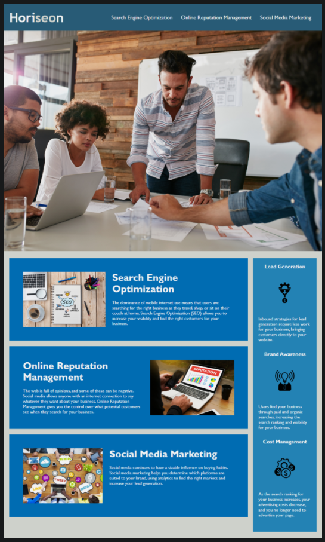

# Horiseon's Code Refactor

## Welcome to my first coding project.

This project features an assignment that mimics an on-the-job ticket.

Our client, Horiseon, had a mostly-functional, visually appealing website
that did not quite meet accessiblity standards. As a marketing agency, they
needed a functional codebase that met accessibility standards so that they
could be found through search engine optimization. They also wanted to reach
a larger audience of people by improving their site's accessibility functions.

When first looking at the codebase I was given, I found that the site was full
of "div soup". There were many meaningless sections, as well as repetitive
CSS style sections. Going through the code methodically, I made sure that
each section was labeled in a way that search engines could understand and read
the site's content as well as an end-user. I also added many accesibility
functions, such as alt attributes in the image tags and increased color
contrast in the title of the page.

Through the process of refactoring this code, I learned that altering one section
of HTML can vastly affect your site, even breaking it at times. It is important
to structure your elements and CSS in a consise and easy-to-understand way.

Although the site still looks the same visually, the code has changed drastically
throughout the course of this project. It helped me appreciate that creating
readable code from the start will save many programmers time and energy when
they, too, have to read my code later down the line. Implementing things like
reusable classes, and comments for readability makes the difference.

## Usage and Features

You can find the link to my deployed site here: https://ashlynn4567.github.io/Challenge1-CodeRefactor/

The site appears as below:

```md

```

## Credits

Used the initial codebase found at this github link: https://github.com/coding-boot-camp/urban-octo-telegram
by Xandromus with coding-boot-camp.

Made with ❤️️ by Horiseon Social Solution Services, Inc.
